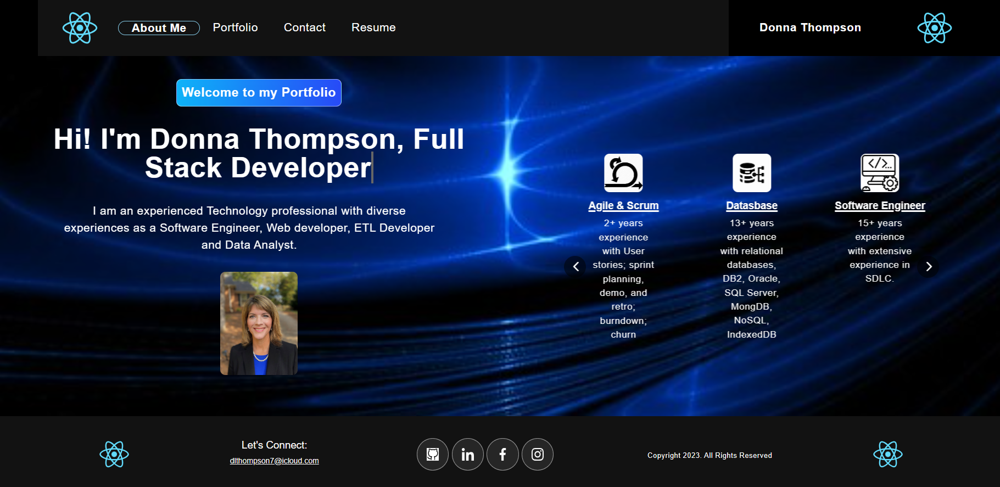

# **React Portfolio**

  [](https://opensource.org/licenses/MIT)

  ## **Description**
  This **React Portfolio** is a single-page application using the latest technologies. The portfolio allows a developer to share experience, projects, and resume while applying for jobs or working as a freelancer, and also to share work with other developers and collaborate on projects. This application is currently deployed to GitHub Pages. Back-end functionality will be added in future releases. 

  ## **Table of Contents:**
  * [Technology Used](#technology-used)
  * [Installation](#installation)
  * [Screenshot of app](#screenshot-of-app) 
  * [Link to deployed app via GitHub Pages](#link-to-deployed-app-via-github-pages)
  * [Usage](#usage)
  * [Credits](#credits)
  * [Contribute](#contribute)
  * [License](#license)
  * [GitHub Repository](#github-repository)
  * [Questions](#questions)

  ## **Technology Used**
  This React single-page application uses many React components and packages, animation, svg files, bootstrap, css, responsive sizing and more. This application is currently deployed to GitHub Pages. Back-end functionality will be added in future releases.

  ## **Installation**
  To download the source code for this app, clone the [Portfolio GitHub repo](https://github.com/DonnaThompson7/DThompson-Portfolio), then run `npm install`. This will create the node_modules directory in your current directory (if one doesnt exist yet) and will download the package to that directory. You can check to see if you already have node.js installed by running either the npm -v or the npm version command. Note:If there is no package.jsonfile in the local directory, the latest version of the package is installed. To start the app, run `npm start`.

  ## **Screenshot of app**
 
  

  ## **Link to deployed app via GitHub Pages**
 [Link to Portfolio](https://donnathompson7.github.io/DThompson-Portfolio/)
 
  ## **Usage**

  This portfolio satisfies the following requirements:
  
  User Story 
```md
AS AN employer looking for candidates with experience building single-page applications
I WANT to view a potential employee's deployed React portfolio of work samples
SO THAT I can assess whether they're a good candidate for an open position
```
Acceptance Criteria
```md
GIVEN a single-page application portfolio for a web developer
WHEN I load the portfolio
THEN I am presented with a page containing a header, a section for content, and a footer
WHEN I view the header
THEN I am presented with the developer's name and navigation with titles corresponding to different sections of the portfolio
WHEN I view the navigation titles
THEN I am presented with the titles About Me, Portfolio, Contact, and Resume, and the title corresponding to the current section is highlighted
WHEN I click on a navigation title
THEN I am presented with the corresponding section below the navigation without the page reloading and that title is highlighted
WHEN I load the portfolio the first time
THEN the Home title and Hero section are selected by default
WHEN I am presented with the Hero section
THEN I see a recent photo and eye-catching tagline and animation
WHEN I am presented with the About Me section
THEN I see the name of the developer and a short bio about them, and their experience and skills. 
WHEN I am presented with the Portfolio section
THEN I see titled images of six of the developer’s applications with links to both the deployed applications and the corresponding GitHub repositories
WHEN I am presented with the Contact section
THEN I see a contact form with fields for a name, an email address, and a message
WHEN I move my cursor out of one of the form fields without entering text
THEN I receive a notification that this field is required
WHEN I enter text into the email address field
THEN I receive a notification if I have entered an invalid email address
WHEN I am presented with the Resume section
THEN I see a link to a downloadable resume and a list of the developer’s proficiencies
WHEN I view the footer
THEN I am presented with text or icon links to the developer’s GitHub and LinkedIn profiles, and their profile on a third platform (Stack Overflow, Twitter)
```

  ## **Credits**
  Donna Thompson, developer

  2-hour tutorial by judygab: https://www.youtube.com/watch?v=hYv6BM2fWd8

  Tutorial by Chris Benjamin: Responsive Skill Icons for your Portfolio: https://blog.chrisbenjamin.dev/responsive-skill-icons-for-your-portfolio-tutorial#Permalinkreact%20Components
  
  Online documentation for many React components and packages, animation, svg files, bootstrap, css, responsive sizing and more.

  ## **Contribute**
  If you would like to contribute to this app, please submit contributions to the email below.

  ## **License**
Licensed under [The MIT License](https://opensource.org/licenses/MIT).

  ## **GitHub Repository** 
  [github.com/DonnaThompson7/DThompson-Portfolio](https://github.com/DonnaThompson7/DThompson-Portfolio)

  ## **Questions**
  Please visit my GitHub profile at https://github.com/DonnaThompson7 <br /> Contact me at dlthompson7@icloud.com to report issues, contribute, or if you have additional questions.
